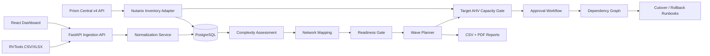

# Nutanix Migration Factory

A production-oriented migration assessment, readiness-control and wave-planning platform for VMware-to-Nutanix programs.

> **Project status:** v1.0 release candidate in development. The application performs inventory ingestion, normalization, migration-complexity assessment, source-to-AHV network mapping, readiness checks, wave planning, cutover/rollback runbook generation, reporting, and optional Prism Central inventory discovery. It does **not** claim to replace Nutanix Move compatibility checks or Nutanix professional services guidance.

## Why this project exists

Enterprise VMware-to-Nutanix programs need more than a spreadsheet. Teams need repeatable discovery, transparent migration-risk reasoning, application grouping, network mapping, wave planning, readiness gates, cutover artifacts, rollback controls, and an auditable handover process.

This repository implements that workflow as software.

## Capabilities

- Import RVTools-style CSV and `.xlsx` inventory exports
- Flexible column normalization for common RVTools `vInfo` fields
- Persist discovered workloads in PostgreSQL/SQLite
- Calculate an explainable **migration complexity score**
- Deterministic source network → AHV subnet mapping
  - exact mappings
  - wildcard rules such as `PROD-*`
- Pre-migration readiness controls
  - blocked workloads
  - ready-with-warning workloads
  - clean ready workloads
- Application-aware migration-wave planning
- Target AHV cluster capacity profiles with explicit CPU overcommit + headroom policy
- Per-wave placement evaluation and ranked target-cluster candidates
- Prism Central cluster identity reconciliation (extId/name)
- Migration approval workflow gated by readiness + capacity
- Planning audit history for cluster, capacity and approval events
- Explicit workload dependency graph with cycle prevention
- Dependency-aware service start/stop sequencing in wave runbooks
- Downloadable implementation-planning PDF report
- Migration execution evidence workflow gated by an approved change request
- Execution state machine: Planned → InProgress → Succeeded / RolledBack / Failed
- Measured cutover duration, UAT status, rollback reason and evidence references
- ZIP evidence bundle with PDF, CSV, execution JSON and SHA-256 integrity manifest
- Dependency-aware wave optimizer with CPU/RAM/storage/VM constraints
- Pilot-first or risk-first migration sequencing strategies
- Optional service-key RBAC for self-hosted/private deployments
- Prometheus metrics, request correlation and structured HTTP logs
- Optional Prometheus + Grafana Docker Compose observability profile
- API/database readiness endpoint and container health checks
- Alembic database migrations with migration validation in CI
- Per-wave cutover + rollback runbook generation
- CSV migration-plan report export
- Read-only Prism Central v4 discovery connector
  - connection test
  - paginated registered-cluster inventory
  - paginated AHV VM inventory
  - paginated subnet inventory
  - target-network → Prism subnet reconciliation
  - explicit inventory truncation indicators
- React dashboard
- Docker Compose local stack
- Backend test suite
- GitHub Actions CI
- HLD, LLD, security and migration methodology documentation

## Architecture



## Tech stack

- **Frontend:** React, TypeScript, Vite
- **Backend:** Python, FastAPI, SQLAlchemy, Pydantic
- **Database:** PostgreSQL in Docker; SQLite fallback
- **Nutanix integration:** Prism Central v4 REST APIs
- **CI:** GitHub Actions
- **Packaging:** Docker / Docker Compose

## Quick start

```bash
cp .env.example .env
docker compose up --build
```

Open:

- UI: `http://localhost:5173`
- API: `http://localhost:8000`
- OpenAPI: `http://localhost:8000/docs`

The API container runs `alembic upgrade head` before starting Uvicorn.

### Running the backend without Docker

```bash
cd backend
pip install -r requirements.txt
alembic upgrade head
uvicorn app.main:app --reload
```

Schema creation is intentionally migration-driven; the application no longer mutates database structure implicitly at startup.

## Typical migration workflow

```text
RVTools export
    ↓
Inventory normalization
    ↓
Complexity assessment
    ↓
Source → AHV network mapping
    ↓
Readiness gate
    ↓
Application-aware migration waves
    ↓
Target AHV capacity evaluation
    ↓
Readiness + capacity approval gate
    ↓
Dependency-aware service sequencing
    ↓
Wave cutover + rollback runbook
    ↓
Nutanix Move execution / Prism validation
    ↓
UAT + handover
```

## API examples

### 1. Import inventory

```bash
curl -F "file=@samples/rvtools_sample.csv" \
  http://localhost:8000/api/v1/imports/rvtools
```

### 2. Run complexity assessment

```bash
curl -X POST http://localhost:8000/api/v1/assessments/run
```

### 3. Apply network mappings

```bash
curl -X POST http://localhost:8000/api/v1/planning/network-map \
  -H "Content-Type: application/json" \
  -d '{
    "rules": [
      {"source":"VLAN120","target":"AHV-PROD-APP"},
      {"source":"VLAN121","target":"AHV-PROD-DB"},
      {"source":"DEV-*","target":"AHV-DEV"}
    ]
  }'
```

### 4. Check readiness

```bash
curl http://localhost:8000/api/v1/planning/readiness
```

Example statuses:

```text
Ready
Ready with warnings
Blocked
```

A missing target network or unknown guest OS can block a workload. Snapshots, very low downtime tolerance, large disks, or many NICs can create warnings.

### 5. Plan migration waves

```bash
curl -X POST \
  "http://localhost:8000/api/v1/waves/plan?max_vms=20&max_storage_gb=5000"
```

### 6. Generate a cutover / rollback runbook

```bash
curl http://localhost:8000/api/v1/planning/waves/1/runbook
```

### 7. Add a target AHV capacity profile

```bash
curl -X POST http://localhost:8000/api/v1/capacity/clusters \
  -H "Content-Type: application/json" \
  -d '{
    "name":"AHV-PROD-A",
    "prism_ext_id":"",
    "physical_cpu_cores":64,
    "cpu_overcommit_ratio":4,
    "allocated_vcpu":80,
    "total_memory_gb":1024,
    "used_memory_gb":320,
    "usable_storage_gb":20000,
    "used_storage_gb":7000,
    "enabled":true
  }'
```

### 8. Evaluate a wave against target capacity

```bash
curl "http://localhost:8000/api/v1/capacity/waves/1/evaluate?headroom_percent=20"
```

The CPU value is an explicit planning envelope based on physical cores × configured overcommit ratio. It is **not** an automatic Nutanix sizing recommendation.

### 9. Request migration approval

```bash
curl -X POST http://localhost:8000/api/v1/approvals/waves/1/request \
  -H "Content-Type: application/json" \
  -d '{
    "target_cluster_id":1,
    "requested_by":"migration.engineer",
    "change_ticket":"CHG-2026-0042",
    "headroom_percent":20,
    "notes":"Pilot wave after application-owner validation"
  }'
```

A wave cannot enter approval while readiness blockers remain or when the selected target cluster fails the configured capacity policy.

### 10. Approve or reject the migration wave

```bash
curl -X POST http://localhost:8000/api/v1/approvals/1/decision \
  -H "Content-Type: application/json" \
  -d '{
    "decision":"Approved",
    "decided_by":"change.manager",
    "notes":"CAB approval recorded in CHG-2026-0042"
  }'
```

### 11. Define an application dependency

```bash
curl -X POST http://localhost:8000/api/v1/dependencies \
  -H "Content-Type: application/json" \
  -d '{
    "upstream_workload_id":1,
    "downstream_workload_id":2,
    "dependency_type":"service",
    "notes":"Application tier depends on database tier"
  }'
```

The dependency API rejects circular graphs. Wave runbooks use the resulting topology to generate deterministic service start and stop orders.

### 12. Export the implementation PDF

```bash
curl -o nutanix-implementation-report.pdf \
  http://localhost:8000/api/v1/reports/implementation-report.pdf
```

The PDF includes estate totals, migration waves, target capacity profiles, governance approvals and application dependencies.

### 13. Export the migration plan


```bash
curl -o migration-plan.csv \
  http://localhost:8000/api/v1/reports/migration-plan.csv
```

## Dependency-aware optimizer

The optimizer groups application workloads atomically, respects explicit upstream/downstream dependencies, and packs groups into migration waves using configurable constraints:

```text
max VMs
max vCPU
max memory GB
max storage GB
strategy = pilot_first | risk_first
```

Example:

```bash
curl -X POST \
  "http://localhost:8000/api/v1/optimizer/waves?max_vms=20&max_vcpu=160&max_memory_gb=512&max_storage_gb=5000&strategy=pilot_first"
```

Oversized application groups are not silently split. They are isolated in their own wave with an explicit warning so an engineer can review the exception.

## Optional service-key RBAC

Authentication is disabled by default for local development. For a private/self-hosted deployment, set:

```env
AUTH_ENABLED=true
VIEWER_API_KEY_SHA256=<sha256>
OPERATOR_API_KEY_SHA256=<sha256>
APPROVER_API_KEY_SHA256=<sha256>
ADMIN_API_KEY_SHA256=<sha256>
```

Generate a SHA-256 hash without storing the plaintext key in source control:

```bash
python -c "import hashlib; print(hashlib.sha256(b'your-strong-random-key').hexdigest())"
```

Use the plaintext key only at request time:

```text
X-API-Key: <plaintext-key>
```

Roles are deliberately separated: viewers are read-only, operators perform migration-planning mutations, approvers decide migration approvals, and admins can perform all actions. This is a service-key control for self-hosted deployments; enterprise SSO/OIDC remains the preferred production identity architecture.

## Observability

Application telemetry is exposed at:

```text
GET /metrics
GET /health
GET /ready
```

Every API response also receives an `X-Request-ID` correlation ID. HTTP request count/latency metrics use route templates instead of raw IDs to avoid high-cardinality Prometheus labels.

Start the optional observability stack:

```bash
docker compose --profile observability up --build
```

Then open:

```text
Prometheus: http://localhost:9090
Grafana:    http://localhost:3000
```

Change the Grafana development password before using the stack outside a local environment.

## Migration execution evidence

Planning is not the same as execution. v0.5 adds an explicit evidence lifecycle that can only begin from an **Approved** migration request.

```text
Approved change
    ↓
Execution record: Planned
    ↓
Start: InProgress
    ↓
Succeeded | RolledBack | Failed
```

A successful record requires:
- measured cutover duration
- UAT status of `Passed` or `Conditional`
- a validation summary

A rollback requires an explicit rollback reason. The record may also store the Nutanix Move plan name, change ticket, operator and a sanitized evidence reference.

Example:

```bash
curl -X POST http://localhost:8000/api/v1/executions \
  -H "Content-Type: application/json" \
  -d '{
    "approval_id": 1,
    "operator": "migration.engineer",
    "move_plan_name": "ERP-WAVE-01",
    "evidence_reference": "CHG-2026-0042"
  }'
```

Then start it:

```bash
curl -X POST http://localhost:8000/api/v1/executions/1/transition \
  -H "Content-Type: application/json" \
  -d '{"action":"start","actor":"migration.engineer"}'
```

And only after the real cutover, record measured results:

```bash
curl -X POST http://localhost:8000/api/v1/executions/1/transition \
  -H "Content-Type: application/json" \
  -d '{
    "action":"complete",
    "actor":"migration.engineer",
    "cutover_duration_minutes":12,
    "uat_status":"Passed",
    "validation_summary":"Guest boot, DNS and application smoke tests passed.",
    "evidence_reference":"CHG-2026-0042"
  }'
```

The execution record is **operator-entered evidence**. Migration Factory does not independently claim Nutanix Move executed the migration; this distinction is intentional so portfolio/CV evidence remains auditable.

### Export an evidence bundle

```bash
curl -o nutanix-migration-evidence-bundle.zip \
  http://localhost:8000/api/v1/reports/evidence-bundle.zip
```

The ZIP contains:

```text
implementation-report.pdf
migration-plan.csv
executions.json
manifest.json
```

`manifest.json` records the SHA-256 digest and byte size of each exported artifact. This provides an integrity checkpoint for the bundle as exported; it does not prove that operator-entered measurements are factually correct.

## Enterprise CAB / change package

An **Approved** migration request can now be exported as a change-management handoff bundle:

```text
GET /api/v1/reports/approvals/{approval_id}/cab-package.zip
```

The ZIP contains a CAB summary PDF, change request, dependency-aware implementation plan, rollback template, validation plan, scoped workload CSV, approval snapshot, readiness snapshot, capacity snapshot, dependency map, available execution/technical-validation evidence, and a SHA-256 manifest.

The generator refuses pending/rejected approvals and keeps infrastructure validation distinct from application-owner UAT. Customer-specific maintenance windows, communication plans, stakeholder contacts, rollback thresholds and final business go/no-go remain under the authorized change process.

See `docs/CAB_CHANGE_PACKAGE.md`.

## Technical validation evidence

v0.8 connects post-migration infrastructure checks to a specific migration execution record instead of leaving validation as an unstructured note.

```text
POST /api/v1/validation/executions/{execution_id}
GET  /api/v1/validation
GET  /api/v1/validation/executions/{execution_id}
```

A record stores:

- validation tool and actor
- Passed / Partial / Failed status
- hosts total / passed / failed
- Prism validation status
- guest validation status
- optional SHA-256 digest of the external validation artifact
- sanitized evidence reference
- technical summary

Validation cannot be recorded while an execution is still `Planned`. A `Passed` record cannot contain failed hosts/checks, and SHA-256 values are validated before persistence.

Technical validation records are added to the implementation PDF and the evidence ZIP as `technical-validations.json`. These remain operator-recorded evidence: the application preserves provenance and integrity metadata but does not claim it independently witnessed the Ansible, Prism or Nutanix Move activity.

## Ansible post-migration validation export

Migration Factory can generate a **no-secret post-migration Ansible validation pack**:

```text
GET /api/v1/reports/ansible-validation-pack.zip
```

The pack includes the official `nutanix.ncp` collection, Prism Central cluster-discovery validation, Linux guest checks, Windows WinRM checks, generated inventory placeholders, workload metadata, and a SHA-256 manifest.

The exported guest addresses are intentionally `REPLACE_WITH_MIGRATED_GUEST_IP`; Migration Factory does not invent production IP addresses. Prism and guest credentials are never embedded. Use Ansible Vault or an external secret manager.

CI installs the generated collection requirements and runs `ansible-playbook --syntax-check` across the generated validation playbooks.

This is technical post-migration validation. It does not replace application-owner UAT.

## Terraform / Infrastructure as Code export

Migration Factory can generate a **reviewable Nutanix Terraform pack** from the current normalized estate:

```text
GET /api/v1/reports/terraform-pack.zip
```

The pack contains:

```text
README.md
versions.tf
provider.tf
variables.tf
locals.tf
planned_vms.tf
outputs.tf
terraform.tfvars.example
inventory.json
manifest.json
```

The generated configuration targets the official `nutanix/nutanix` provider 2.4.x family and uses `nutanix_virtual_machine_v2`. The provider configuration uses Prism Central endpoint + API-key authentication.

### Safety boundary

`enable_vm_creation` defaults to **false**.

Migration Factory does not treat Terraform as a replacement for Nutanix Move. The VM resource scaffold is intended for code review, approved rebuild/greenfield scenarios, and demonstrating how normalized migration data maps into IaC. It deliberately does not infer boot disks, images, storage containers, IP addresses, guest customization, or application data.

CI generates a representative pack and executes:

```bash
terraform fmt -check
terraform init -backend=false
terraform validate
```

This means the exported HCL is continuously schema-validated against the declared Terraform provider surface, while any real `terraform apply` remains a separately approved action in an authorized Nutanix environment.

## Live Prism environment evidence

Migration Factory can persist a **sanitized, read-only Prism Central environment evidence record** directly from the configured connector:

```text
POST /api/v1/nutanix/evidence-snapshots
GET  /api/v1/nutanix/evidence-snapshots
```

Each record captures the observed cluster/VM/subnet counts, target-network reconciliation totals, inventory-truncation flags and a SHA-256 digest of the complete in-memory Prism inventory snapshot. The raw Prism payload is not persisted by this feature.

A clean capture is recorded as `Captured`. Missing/ambiguous target networks or an inventory cap produce `CapturedWithWarnings`; this is deliberately not a compatibility or production-readiness certification.

The snapshots are included in the implementation PDF, the evidence ZIP, and the latest snapshot is embedded in generated CAB packages.

## Live Prism Central discovery


The read-only connector uses the Nutanix v4 API family for clusters, AHV VMs and networking subnets.

```text
GET /api/clustermgmt/v4.0/ahv/config/clusters
GET /api/vmm/v4.0/ahv/config/vms
GET /api/networking/v4.0/config/subnets
```

Migration Factory exposes:

```text
GET /api/v1/nutanix/connection-test
GET /api/v1/nutanix/environment-summary
GET /api/v1/nutanix/subnets
GET /api/v1/nutanix/network-reconcile
```

The inventory collector paginates with `$page` / `$limit`, enforces a configurable maximum inventory size, and reports when its own cap truncates the result. Network reconciliation compares planned AHV target names with live Prism subnet names and reports **Matched**, **Missing** or **Ambiguous**.

No Prism mutation is executed by these endpoints.

## Prism Central connector


Configure:

```bash
NUTANIX_PC_URL=https://prism-central.example.com:9440
NUTANIX_USERNAME=svc_migration_factory
NUTANIX_PASSWORD=change-me
NUTANIX_VERIFY_TLS=true
```

Current read-only discovery endpoints:

```text
GET /api/clustermgmt/v4.0/ahv/config/clusters
GET /api/vmm/v4.0/ahv/config/vms
```

No destructive Nutanix operation is executed by the current connector.

## Engineering boundaries

### Migration complexity is not compatibility

The score is an explainable prioritization mechanism based on workload size, downtime tolerance, business criticality, OS confidence, snapshots, NIC count and similar migration factors.

It does **not** certify that a workload is supported by Nutanix Move or AHV.

### Readiness is a planning gate

The readiness engine validates whether the data needed to plan a controlled migration is present. Final product supportability must be validated against the current Nutanix Move documentation and the actual target environment.

## Real-world evidence required before claiming production Nutanix migration experience

This repository is genuine engineering work, but production Nutanix implementation experience requires a real authorized environment. The next evidence milestones are:

1. Run the platform against a sanitized real VMware inventory.
2. Connect it to an authorized Prism Central environment.
3. Map actual VMware port groups to actual AHV subnets.
4. Validate target-cluster capacity.
5. Execute a pilot workload with Nutanix Move.
6. Execute an approved migration wave.
7. Record measured cutover duration, UAT result and rollback criteria.
8. Publish sanitized operational evidence and handover material.

## Roadmap

### v0.9
- [x] approval-linked enterprise CAB package generator
- [x] Approved-only change-package gate
- [x] CAB summary PDF
- [x] change-request Markdown
- [x] dependency-aware implementation plan
- [x] rollback plan template
- [x] technical + application-owner validation plan
- [x] scoped workload inventory CSV
- [x] readiness and target-capacity snapshots
- [x] approval/dependency/execution evidence snapshots
- [x] SHA-256 package manifest
- [x] approved-change download from React governance dashboard
- [ ] populate organization-specific maintenance window and communication fields
- [ ] generate a real CAB package for an authorized migration change


### v0.8
- [x] execution-linked technical validation records
- [x] Passed / Partial / Failed validation lifecycle
- [x] host pass/fail accounting validation
- [x] Prism and guest validation status
- [x] optional external artifact SHA-256
- [x] technical validation audit events
- [x] validation records in implementation PDF
- [x] validation JSON in integrity-manifest evidence bundle
- [x] React technical-validation dashboard
- [x] Alembic technical-validation migration
- [ ] ingest machine-generated Ansible result artifact from an authorized migration
- [ ] bind external artifact digest to a real execution evidence reference


### v0.7
- [x] generated Ansible post-migration validation pack
- [x] official `nutanix.ncp` collection requirement
- [x] Prism Central v4-backed cluster validation playbook
- [x] Linux guest reachability/facts validation
- [x] Windows WinRM validation
- [x] generated inventory with no production IP guessing
- [x] no embedded Prism or guest credentials
- [x] SHA-256 artifact manifest
- [x] authenticated dashboard download
- [x] CI collection install + playbook syntax checks
- [ ] run against authorized migrated guests
- [ ] record application-specific UAT plugins/checks
- [ ] integrate approved validation results into execution evidence


### v0.6
- [x] generated Nutanix Terraform pack
- [x] official `nutanix/nutanix` provider declaration
- [x] `nutanix_virtual_machine_v2` planning scaffold
- [x] API-key based provider configuration
- [x] VM creation safety gate defaults to disabled
- [x] subnet-extId mapping input
- [x] workload inventory + SHA-256 manifest
- [x] authenticated Terraform ZIP download in React
- [x] CI `terraform fmt/init/validate`
- [ ] validate generated plan against an authorized Prism Central environment
- [ ] add reviewed disk/image/storage-container mapping workflow
- [ ] add Ansible post-migration validation export


### v0.2
- [x] network mapping engine
- [x] readiness controls
- [x] wave runbook generation
- [x] automated tests
- [x] dashboard for mapping/readiness
- [x] target AHV capacity model
- [x] Prism cluster identity reconciliation
- [x] migration approval/audit workflow
- [x] approval dashboard
- [x] persistent target-cluster update/edit workflow

### v0.5
- [x] approved-change → migration execution record
- [x] explicit execution state machine
- [x] measured cutover duration
- [x] UAT / validation evidence
- [x] rollback outcome and reason
- [x] evidence-reference field
- [x] execution evidence in implementation PDF
- [x] execution dashboard
- [x] SHA-256 integrity-manifest evidence bundle
- [x] Alembic execution-evidence migration
- [ ] execute an authorized Nutanix Move pilot and populate a real execution record

### v0.4
- [x] Prism connection-test endpoint
- [x] GA v4 subnet inventory endpoint
- [x] paginated cluster/VM/subnet discovery
- [x] inventory truncation visibility
- [x] target-network → live Prism subnet reconciliation
- [x] React live-discovery dashboard
- [ ] validate against an authorized Prism Central environment
- [ ] add supported live utilization/statistics adapter after environment/version validation

### v0.3
- [x] workload dependency graph
- [x] cycle prevention
- [x] dependency-aware wave runbooks
- [x] dependency-aware migration-wave optimizer
- [x] pilot-first / risk-first sequencing strategy
- [x] PDF implementation / handover report
- [x] dependency planner UI
- [x] optional service-key RBAC
- [x] Prometheus application metrics
- [x] Grafana dashboard and Compose observability profile
- [x] request correlation / structured HTTP logging
- [x] readiness endpoint and API healthcheck
- [x] Alembic database migrations
- [x] migration validation in CI
- [ ] live target-cluster utilization adapter using supported telemetry APIs
- [ ] enterprise SSO / OIDC

### v1.0
- [x] persisted read-only Prism environment evidence snapshots
- [x] live cluster / VM / subnet count capture
- [x] planned target-network reconciliation evidence
- [x] explicit inventory-truncation evidence
- [x] SHA-256 digest of the in-memory Prism inventory snapshot
- [x] no raw Prism inventory persistence in the evidence record
- [x] Prism evidence audit event
- [x] React evidence-capture history
- [x] Prism evidence in implementation PDF
- [x] Prism evidence in SHA-256 evidence bundle
- [x] latest Prism evidence in CAB package
- [x] Alembic revision 0004
- [ ] validate against an authorized Prism Central environment
- [ ] validate against sanitized enterprise VMware data
- [ ] execute and document a Nutanix Move pilot migration

## Official references

- Nutanix v4 API reference: https://www.nutanix.dev/api-reference-v4/
- Nutanix API user guide: https://www.nutanix.dev/nutanix-api-user-guide/
- VMware to Nutanix migration overview: https://www.nutanix.com/how-to/steps-to-migrate-to-nutanix-from-vmware

## License

MIT
