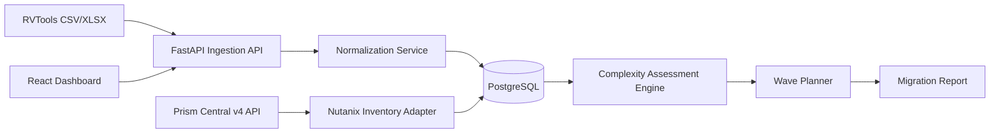

# Nutanix Migration Factory

A production-oriented migration assessment and wave-planning platform for VMware-to-Nutanix programs.

> **Project status:** working MVP. The application performs inventory ingestion, normalization, migration-complexity assessment, wave planning, report generation, and optional Prism Central inventory discovery. It does **not** claim to replace Nutanix Move compatibility checks or Nutanix professional services guidance.

## Why this project exists

Enterprise VMware-to-Nutanix programs need more than a spreadsheet. Teams need repeatable discovery, transparent migration risk scoring, application grouping, network mapping, wave planning, cutover artifacts, and an auditable handover process.

This repository implements that workflow as software.

## Capabilities

- Import RVTools-style CSV and `.xlsx` inventory exports
- Flexible column normalization for common RVTools `vInfo` fields
- Persist discovered workloads in PostgreSQL/SQLite
- Calculate a **migration complexity score** with explicit reasons
- Group workloads into migration waves by application group and capacity
- Generate CSV migration-plan reports
- Optional Prism Central v4 inventory connector
  - List registered clusters
  - List VMs
- React dashboard for upload, assessment and wave generation
- Docker Compose local stack
- Backend test suite
- GitHub Actions CI
- Architecture, security and migration-methodology documentation

## Architecture



## Tech stack

- **Frontend:** React, TypeScript, Vite
- **Backend:** Python, FastAPI, SQLAlchemy, Pydantic
- **Database:** PostgreSQL in Docker; SQLite fallback for quick start
- **Nutanix integration:** Prism Central v4 REST APIs using Basic authentication
- **CI:** GitHub Actions
- **Packaging:** Docker / Docker Compose

## Quick start with Docker

```bash
cp .env.example .env
docker compose up --build
```

Then open:

- UI: `http://localhost:5173`
- API: `http://localhost:8000`
- OpenAPI: `http://localhost:8000/docs`

## Quick start without Docker

### Backend

```bash
cd backend
python -m venv .venv
source .venv/bin/activate
pip install -r requirements.txt
uvicorn app.main:app --reload
```

### Frontend

```bash
cd frontend
npm install
npm run dev
```

## Import format

Use `samples/rvtools_sample.csv` or an RVTools `.xlsx` export containing a `vInfo` sheet.

The parser recognizes common fields such as:

- Name / VM
- CPUs
- Memory / Memory MiB
- Provisioned MiB / Capacity
- OS according to config file
- Network #1
- Folder / Resource Pool / Annotation
- Powerstate
- Snapshots

Optional portfolio-specific fields can also be supplied:

- `Criticality`
- `Downtime Minutes`
- `App Group`
- `Target Network`
- `Owner`

## Prism Central connector

Set these variables in `.env`:

```bash
NUTANIX_PC_URL=https://prism-central.example.com:9440
NUTANIX_USERNAME=svc_migration_factory
NUTANIX_PASSWORD=change-me
NUTANIX_VERIFY_TLS=true
```

Endpoints used by this MVP:

```text
GET /api/clustermgmt/v4.0/ahv/config/clusters
GET /api/vmm/v4.0/ahv/config/vms
```

Nutanix v4 APIs are the current recommended API family and provide GA namespaces for cluster and VM management on supported Prism Central/AOS releases.

## API examples

### Upload inventory

```bash
curl -F "file=@samples/rvtools_sample.csv" \
  http://localhost:8000/api/v1/imports/rvtools
```

### Run complexity assessment

```bash
curl -X POST http://localhost:8000/api/v1/assessments/run
```

### Plan migration waves

```bash
curl -X POST "http://localhost:8000/api/v1/waves/plan?max_vms=20&max_storage_gb=5000"
```

### Export plan

```bash
curl -o migration-plan.csv \
  http://localhost:8000/api/v1/reports/migration-plan.csv
```

## What the score means

The score is deliberately named **migration complexity**, not “Nutanix compatibility.” It is an explainable prioritization mechanism based on workload size, downtime tolerance, business criticality, OS confidence, snapshots, NIC count and similar factors. Final migration supportability must be verified against current Nutanix Move/product documentation and the target environment.

## Real project evidence to add next

To turn this repository into strong job evidence:

1. Run it against a sanitized real VMware estate export.
2. Connect to an authorized Prism Central environment.
3. Reconcile generated target mappings with actual AHV networks/clusters.
4. Execute a real migration wave with Nutanix Move.
5. Record actual cutover duration and validation results.
6. Publish sanitized before/after runbooks and a demo video.

## Official references

- Nutanix v4 API reference: https://www.nutanix.dev/api-reference-v4/
- Nutanix API user guide: https://www.nutanix.dev/nutanix-api-user-guide/
- VMware to Nutanix migration overview: https://www.nutanix.com/how-to/steps-to-migrate-to-nutanix-from-vmware

## License

MIT
