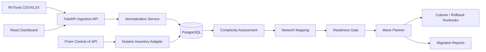

# Nutanix Migration Factory

A production-oriented migration assessment, readiness-control and wave-planning platform for VMware-to-Nutanix programs.

> **Project status:** v0.2 in development. The application performs inventory ingestion, normalization, migration-complexity assessment, source-to-AHV network mapping, readiness checks, wave planning, cutover/rollback runbook generation, reporting, and optional Prism Central inventory discovery. It does **not** claim to replace Nutanix Move compatibility checks or Nutanix professional services guidance.

## Why this project exists

Enterprise VMware-to-Nutanix programs need more than a spreadsheet. Teams need repeatable discovery, transparent migration-risk reasoning, application grouping, network mapping, wave planning, readiness gates, cutover artifacts, rollback controls, and an auditable handover process.

This repository implements that workflow as software.

## Capabilities

- Import RVTools-style CSV and `.xlsx` inventory exports
- Flexible column normalization for common RVTools `vInfo` fields
- Persist discovered workloads in PostgreSQL/SQLite
- Calculate an explainable **migration complexity score**
- Deterministic source network → AHV subnet mapping
  - exact mappings
  - wildcard rules such as `PROD-*`
- Pre-migration readiness controls
  - blocked workloads
  - ready-with-warning workloads
  - clean ready workloads
- Application-aware migration-wave planning
- Per-wave cutover + rollback runbook generation
- CSV migration-plan report export
- Optional Prism Central v4 inventory connector
  - list registered clusters
  - list VMs
- React dashboard
- Docker Compose local stack
- Backend test suite
- GitHub Actions CI
- HLD, LLD, security and migration methodology documentation

## Architecture



## Tech stack

- **Frontend:** React, TypeScript, Vite
- **Backend:** Python, FastAPI, SQLAlchemy, Pydantic
- **Database:** PostgreSQL in Docker; SQLite fallback
- **Nutanix integration:** Prism Central v4 REST APIs
- **CI:** GitHub Actions
- **Packaging:** Docker / Docker Compose

## Quick start

```bash
cp .env.example .env
docker compose up --build
```

Open:

- UI: `http://localhost:5173`
- API: `http://localhost:8000`
- OpenAPI: `http://localhost:8000/docs`

## Typical migration workflow

```text
RVTools export
    ↓
Inventory normalization
    ↓
Complexity assessment
    ↓
Source → AHV network mapping
    ↓
Readiness gate
    ↓
Application-aware migration waves
    ↓
Wave cutover + rollback runbook
    ↓
Nutanix Move execution / Prism validation
    ↓
UAT + handover
```

## API examples

### 1. Import inventory

```bash
curl -F "file=@samples/rvtools_sample.csv" \
  http://localhost:8000/api/v1/imports/rvtools
```

### 2. Run complexity assessment

```bash
curl -X POST http://localhost:8000/api/v1/assessments/run
```

### 3. Apply network mappings

```bash
curl -X POST http://localhost:8000/api/v1/planning/network-map \
  -H "Content-Type: application/json" \
  -d '{
    "rules": [
      {"source":"VLAN120","target":"AHV-PROD-APP"},
      {"source":"VLAN121","target":"AHV-PROD-DB"},
      {"source":"DEV-*","target":"AHV-DEV"}
    ]
  }'
```

### 4. Check readiness

```bash
curl http://localhost:8000/api/v1/planning/readiness
```

Example statuses:

```text
Ready
Ready with warnings
Blocked
```

A missing target network or unknown guest OS can block a workload. Snapshots, very low downtime tolerance, large disks, or many NICs can create warnings.

### 5. Plan migration waves

```bash
curl -X POST \
  "http://localhost:8000/api/v1/waves/plan?max_vms=20&max_storage_gb=5000"
```

### 6. Generate a cutover / rollback runbook

```bash
curl http://localhost:8000/api/v1/planning/waves/1/runbook
```

### 7. Export the migration plan

```bash
curl -o migration-plan.csv \
  http://localhost:8000/api/v1/reports/migration-plan.csv
```

## Prism Central connector

Configure:

```bash
NUTANIX_PC_URL=https://prism-central.example.com:9440
NUTANIX_USERNAME=svc_migration_factory
NUTANIX_PASSWORD=change-me
NUTANIX_VERIFY_TLS=true
```

Current read-only discovery endpoints:

```text
GET /api/clustermgmt/v4.0/ahv/config/clusters
GET /api/vmm/v4.0/ahv/config/vms
```

No destructive Nutanix operation is executed by the current connector.

## Engineering boundaries

### Migration complexity is not compatibility

The score is an explainable prioritization mechanism based on workload size, downtime tolerance, business criticality, OS confidence, snapshots, NIC count and similar migration factors.

It does **not** certify that a workload is supported by Nutanix Move or AHV.

### Readiness is a planning gate

The readiness engine validates whether the data needed to plan a controlled migration is present. Final product supportability must be validated against the current Nutanix Move documentation and the actual target environment.

## Real-world evidence required before claiming production Nutanix migration experience

This repository is genuine engineering work, but production Nutanix implementation experience requires a real authorized environment. The next evidence milestones are:

1. Run the platform against a sanitized real VMware inventory.
2. Connect it to an authorized Prism Central environment.
3. Map actual VMware port groups to actual AHV subnets.
4. Validate target-cluster capacity.
5. Execute a pilot workload with Nutanix Move.
6. Execute an approved migration wave.
7. Record measured cutover duration, UAT result and rollback criteria.
8. Publish sanitized operational evidence and handover material.

## Roadmap

### v0.2
- [x] network mapping engine
- [x] readiness controls
- [x] wave runbook generation
- [x] automated tests
- [ ] dashboard for mapping/readiness
- [ ] target AHV capacity model
- [ ] migration approval/audit workflow

### v0.3
- target-cluster recommendation
- dependency graph
- migration-wave optimizer
- PDF implementation report
- authentication / RBAC
- observability

### v1.0
- validated against authorized Prism Central
- validated against sanitized enterprise VMware data
- documented pilot migration evidence

## Official references

- Nutanix v4 API reference: https://www.nutanix.dev/api-reference-v4/
- Nutanix API user guide: https://www.nutanix.dev/nutanix-api-user-guide/
- VMware to Nutanix migration overview: https://www.nutanix.com/how-to/steps-to-migrate-to-nutanix-from-vmware

## License

MIT
